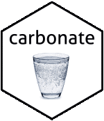
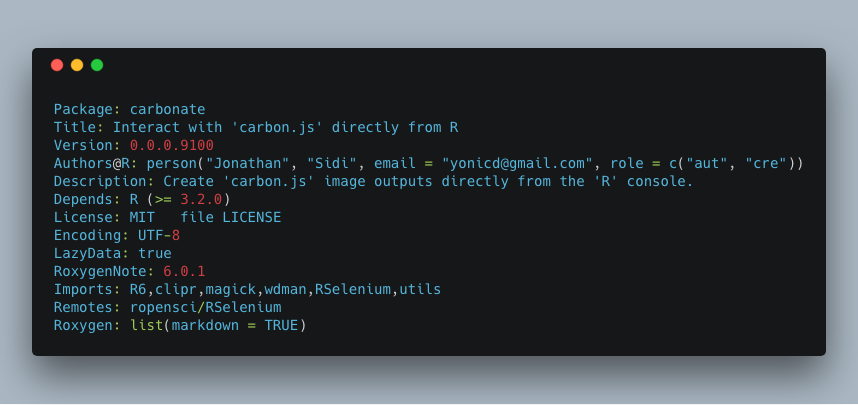

<!-- README.md is generated from README.Rmd. Please edit that file -->

```{r, echo = FALSE,message=FALSE,warning=FALSE}
knitr::opts_chunk$set(
  collapse = TRUE,
  comment = "#>",
  fig.path = "tools/readme/README-",
  eval = TRUE
)

library(magick)
```
[](https://travis-ci.org/yonicd/carbonate)
[](https://codecov.io/github/yonicd/carbonate?branch=master)
[](https://github.com/yonicd/carbonate/tree/tests/tests/README.md)

# carbonate 

"[carbon.js](https://carbon.now.sh/about) is the easiest way to create beautiful images of your source code."

This package uses an `R6` api to interact with carbon.js and create directly from the console carbon images. 

Like the image below:



## Installation

```{r,eval= FALSE}
remotes::install_github('yonicd/carbonate')
```

## Usage

### Initialize new carbon object

```{r}
library(carbonate)
```

The default code in the carbon object is taken from the clipboard.

```{r,eval = FALSE}
x <- carbon$new()
```

But can also be defined inline. Code can be a character object of any length.

```{r}
x <- carbon$new(readLines('DESCRIPTION'))
```

The code is kept in the object and can be changed at any time.

```{r}
x$code
```

The main job of the R6 object is to convert all the options into a uri that is sent to the carbon url page, where it is processed. 

```{r}
x$uri()
```

### Manipulate carbon object

Aesthetics of the carbon object that can be manipulated

|Carbon Variable  |Carbonate Variable |Description | Default | 
|:------:|:-----------------------|:-----------|:----:|
|l      |language                |language          |r|
|bg     |palette                 |layout pallete (vector with c(r,g,b,a)|c(r=171,g=184,b=195,a=1)|
|t      |template                |layout template (listed in get_templates()) |'seti'|
|wc     |add_window_control      |add/remove window controls (circles on top left corner) |TRUE|
|wt     |window_control_theme    |change window control themes  (listed in get_windows_control_themes())        |'none'|
|ds     |add_drop_shadow         |add/remove dropshadow     |TRUE|
|dsyoff |drop_shadow_offset_y    |shadow vertical offset (px) |20|
|dsblur |drop_shadow_blur_radius |shadow blur radius (px) |68|
|wa     |auto_adjust_width       |auto-audjust output width          |TRUE|
|pv     |padding_vertical        |vertical padding (px)          |48|
|ph     |padding_horizontal      |horizontal padding (px)          |32|
|ln     |add_line_number         |add/remove line numbers          |FALSE|
|fm     |font_family             |layout font family (listed in get_font_families())          |'Hack'|
|fs     |font_size               |font size (px)         |14|
|lh     |line_height_percent     |relative space between lines (percent)          |133|
|si     |square_image            |output image is square     |FALSE|
|es     |relative_export_size    |image size in export relative to what is in the preview (1,2 or 4)    |1|
|wm     |add_watermark           |add official carbon.js watermark          |FALSE|

```{r}
x$get_templates()
```

```{r}
x$get_font_families()
```

```{r}
x$get_windows_control_themes()
```

### Personal Configuration

Users can use a file called `carbon.yml` and place it in their home directory (`~`) to override the packages defaults in order to create a session peristent carbon template they like. The config file controls all the [public carbon object fields](#manipulate-carbon-object). The following is an example of such a configuration file. 

These fields will set 

  - The palette (rgba) `g` and `a` fields to 175 and 0.7 respectively
  - The template will be set to `panda-syntax`
  - The font to `Fira Code`
  - The padding around the output will be made tighter than the system defaults 11px and 14px.

```yml
palette:
- g: 175.0
- a: 0.7
template: panda-syntax
font_family: Fira Code
padding_vertical: 11
padding_horizontal: 14
```

### Open carbon code in browser

```{r,eval=FALSE}
x$browse()
```

### Set the download directory

```{r}
x$chrome_pref$download.default_directory <- normalizePath("tools/temp")
```

### Carbonate code directly to file

This function depends on RSelenium

```{r}
x$carbonate(file = 'myfile.png')
```

```{r,echo=FALSE}
Sys.sleep(2)
```

```{r}
x$template <-'cobalt'
x$carbonate(file = 'new_template.png')
```

```{r,echo=FALSE}
Sys.sleep(2)
```

```{r}
x$font_family <-'IBM Plex Mono'
x$carbonate(file = 'new_font.png')
```

### Closing Browsers

Closing all instances of open browsers used by RSelenium.

```r
x$stop_all()
```

### Sharing

<details><summary>Tinyurl</summary>

You can also put a tinyurl link as a watermark on the image produced that will open to the carbon.now.sh page that has the code in the image.

```{r}
x$add_tinyurl <- TRUE
x$carbonate(file = 'tiny_url.png')
```

If you just want the tinyurl link without the image to use in a tweet you can create it using

```{r}
x$tiny()
```

Or you can put the link directly on your clipboard

```{r}
x$tiny(clip = TRUE)
clipr::read_clip()
```

</details>

<details><summary>Twitter</summary>

##### Direct

You can also directly tweet the image. An automatic status is created with two options

  - Default
    - `r 'Created in R using the Carbonate \U0001f4e6'`
    
  - When `add_tinyurl <- TRUE`
    - `r sprintf('%s\nCheck out this script at \U0001f517 %s', 'Created in R using the Carbonate \U0001f4e6', x$tiny())`
    
  - Manual
    - Using `tweet_status` you can write your own status. 

```{r,eval=FALSE}
x <- carbonate::carbon$new()
x$tweet <- TRUE
x$carbonate()
```

##### Post process (Batch)

If you have images stored in `x$carbons` you can post them also in a tweet using.

```{r,eval = FALSE}
# for multiple png attachments
x$rtweet(x$carbons,media_type = 'png') #using default status

# subsets of images
x$rtweet(status='These are images',x$carbons[c(1,3)],media_type = 'png')

# for gifs
x$rtweet(status='This is a gif', x$carbons,media_type = 'gif')
```

</details>

### Post image processing

All carbon outputs are collected and saved in the list `x$carbons`

<details><summary>Combining</summary>

```{r}
x$carbons%>%
  magick::image_scale('300')%>%
  magick::image_append()

x$carbons%>%
  magick::image_scale('300')%>%
  magick::image_append(stack = TRUE)
```

</details>

<details><summary>GIFs</summary>

```{r}
x$carbons%>%
  magick::image_animate(fps = 1)
```

</details>

