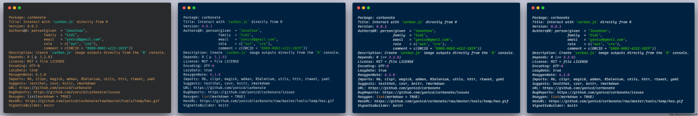
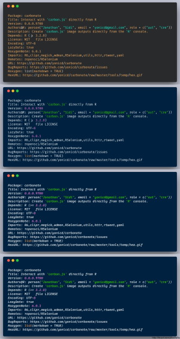
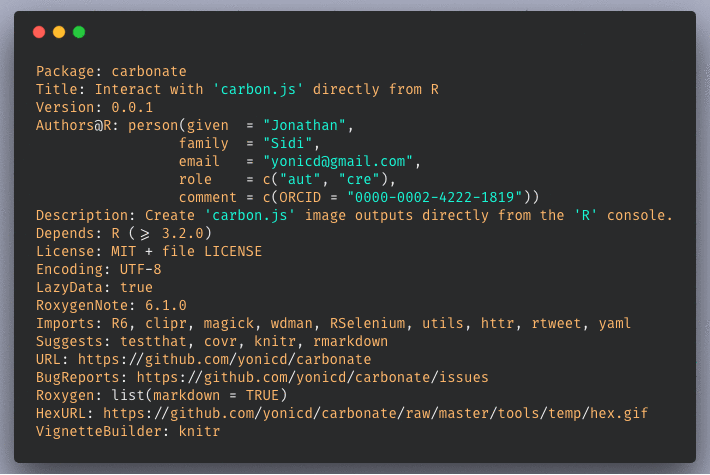

<!-- README.md is generated from README.Rmd. Please edit that file -->
[](https://travis-ci.org/yonicd/carbonate) [](https://codecov.io/github/yonicd/carbonate?branch=master) [](https://goo.gl/gNRcCb)

carbonate 
========================================================

"[carbon.js](https://carbon.now.sh/about) is the easiest way to create beautiful images of your source code."

This package uses an `R6` api to interact with carbon.js and create directly from the console carbon images.

Like the image below:


Installation
------------

``` r
remotes::install_github('yonicd/carbonate')
```

Usage
-----

### Initialize new carbon object

``` r
library(carbonate)
```

The default code in the carbon object is taken from the clipboard.

``` r
x <- carbon$new()
```

But can also be defined inline. Code can be a character object of any length.

``` r
x <- carbon$new(readLines('DESCRIPTION'))
#> Set via '~/carbon.yml'
#> palette:
#> - 171.0
#> - 175.0
#> - 195.0
#> - 0.7
#> template: panda-syntax
#> font_family: Fira Code
#> padding_vertical: 11
#> padding_horizontal: 14
#> language: r
```

The code is kept in the object and can be changed at any time.

``` r
x$code
#>  [1] "Package: carbonate"                                                          
#>  [2] "Title: Interact with 'carbon.js' directly from R"                            
#>  [3] "Version: 0.0.1"                                                              
#>  [4] "Authors@R: person(given  = \"Jonathan\","                                    
#>  [5] "                 family  = \"Sidi\","                                        
#>  [6] "                 email   = \"yonicd@gmail.com\","                            
#>  [7] "                 role    = c(\"aut\", \"cre\"),"                             
#>  [8] "                 comment = c(ORCID = \"0000-0002-4222-1819\"))"              
#>  [9] "Description: Create 'carbon.js' image outputs directly from the 'R' console."
#> [10] "Depends: R (>= 3.2.0)"                                                       
#> [11] "License: MIT + file LICENSE"                                                 
#> [12] "Encoding: UTF-8"                                                             
#> [13] "LazyData: true"                                                              
#> [14] "RoxygenNote: 6.1.0"                                                          
#> [15] "Imports: R6, clipr, magick, wdman, RSelenium, utils, httr, rtweet, yaml"     
#> [16] "Suggests: testthat, covr, knitr, rmarkdown"                                  
#> [17] "URL: https://github.com/yonicd/carbonate"                                    
#> [18] "BugReports: https://github.com/yonicd/carbonate/issues"                      
#> [19] "Roxygen: list(markdown = TRUE)"                                              
#> [20] "HexURL: https://github.com/yonicd/carbonate/raw/master/tools/temp/hex.gif"   
#> [21] "VignetteBuilder: knitr"
```

The main job of the R6 object is to convert all the options into a uri that is sent to the carbon url page, where it is processed.

``` r
x$uri()
#> [1] "https://carbon.now.sh/?bg=rgba(171%2C175%2C195%2C0.7)&t=panda-syntax&wt=none&l=r&ds=true&dsyoff=20px&dsblur=68px&wc=true&wa=true&pv=11px&ph=14px&ln=false&fm=Fira%20Code&fs=14px&lh=133%25&si=false&es=1x&wm=false&ts=false&code=Package%253A%2520carbonate%250ATitle%253A%2520Interact%2520with%2520%27carbon.js%27%2520directly%2520from%2520R%250AVersion%253A%25200.0.1%250AAuthors%2540R%253A%2520person(given%2520%2520%253D%2520%2522Jonathan%2522%252C%250A%2520%2520%2520%2520%2520%2520%2520%2520%2520%2520%2520%2520%2520%2520%2520%2520%2520family%2520%2520%253D%2520%2522Sidi%2522%252C%250A%2520%2520%2520%2520%2520%2520%2520%2520%2520%2520%2520%2520%2520%2520%2520%2520%2520email%2520%2520%2520%253D%2520%2522yonicd%2540gmail.com%2522%252C%250A%2520%2520%2520%2520%2520%2520%2520%2520%2520%2520%2520%2520%2520%2520%2520%2520%2520role%2520%2520%2520%2520%253D%2520c(%2522aut%2522%252C%2520%2522cre%2522)%252C%250A%2520%2520%2520%2520%2520%2520%2520%2520%2520%2520%2520%2520%2520%2520%2520%2520%2520comment%2520%253D%2520c(ORCID%2520%253D%2520%25220000-0002-4222-1819%2522))%250ADescription%253A%2520Create%2520%27carbon.js%27%2520image%2520outputs%2520directly%2520from%2520the%2520%27R%27%2520console.%250ADepends%253A%2520R%2520(%253E%253D%25203.2.0)%250ALicense%253A%2520MIT%2520%252B%2520file%2520LICENSE%250AEncoding%253A%2520UTF-8%250ALazyData%253A%2520true%250ARoxygenNote%253A%25206.1.0%250AImports%253A%2520R6%252C%2520clipr%252C%2520magick%252C%2520wdman%252C%2520RSelenium%252C%2520utils%252C%2520httr%252C%2520rtweet%252C%2520yaml%250ASuggests%253A%2520testthat%252C%2520covr%252C%2520knitr%252C%2520rmarkdown%250AURL%253A%2520https%253A%252F%252Fgithub.com%252Fyonicd%252Fcarbonate%250ABugReports%253A%2520https%253A%252F%252Fgithub.com%252Fyonicd%252Fcarbonate%252Fissues%250ARoxygen%253A%2520list(markdown%2520%253D%2520TRUE)%250AHexURL%253A%2520https%253A%252F%252Fgithub.com%252Fyonicd%252Fcarbonate%252Fraw%252Fmaster%252Ftools%252Ftemp%252Fhex.gif%250AVignetteBuilder%253A%2520knitr"
```

### Manipulate carbon object

Aesthetics of the carbon object that can be manipulated

<table style="width:75%;">
<colgroup>
<col width="12%" />
<col width="34%" />
<col width="18%" />
<col width="9%" />
</colgroup>
<thead>
<tr class="header">
<th align="center">Carbon Variable</th>
<th align="left">Carbonate Variable</th>
<th align="left">Description</th>
<th align="center">Default</th>
</tr>
</thead>
<tbody>
<tr class="odd">
<td align="center">l</td>
<td align="left">language</td>
<td align="left">language</td>
<td align="center">r</td>
</tr>
<tr class="even">
<td align="center">bg</td>
<td align="left">palette</td>
<td align="left">layout pallete (vector with c(r,g,b,a)</td>
<td align="center">c(r=171,g=184,b=195,a=1)</td>
</tr>
<tr class="odd">
<td align="center">t</td>
<td align="left">template</td>
<td align="left">layout template (listed in get_templates())</td>
<td align="center">'seti'</td>
</tr>
<tr class="even">
<td align="center">wc</td>
<td align="left">add_window_control</td>
<td align="left">add/remove window controls (circles on top left corner)</td>
<td align="center">TRUE</td>
</tr>
<tr class="odd">
<td align="center">wt</td>
<td align="left">window_control_theme</td>
<td align="left">change window control themes (listed in get_windows_control_themes())</td>
<td align="center">'none'</td>
</tr>
<tr class="even">
<td align="center">ds</td>
<td align="left">add_drop_shadow</td>
<td align="left">add/remove dropshadow</td>
<td align="center">TRUE</td>
</tr>
<tr class="odd">
<td align="center">dsyoff</td>
<td align="left">drop_shadow_offset_y</td>
<td align="left">shadow vertical offset (px)</td>
<td align="center">20</td>
</tr>
<tr class="even">
<td align="center">dsblur</td>
<td align="left">drop_shadow_blur_radius</td>
<td align="left">shadow blur radius (px)</td>
<td align="center">68</td>
</tr>
<tr class="odd">
<td align="center">wa</td>
<td align="left">auto_adjust_width</td>
<td align="left">auto-audjust output width</td>
<td align="center">TRUE</td>
</tr>
<tr class="even">
<td align="center">pv</td>
<td align="left">padding_vertical</td>
<td align="left">vertical padding (px)</td>
<td align="center">48</td>
</tr>
<tr class="odd">
<td align="center">ph</td>
<td align="left">padding_horizontal</td>
<td align="left">horizontal padding (px)</td>
<td align="center">32</td>
</tr>
<tr class="even">
<td align="center">ln</td>
<td align="left">add_line_number</td>
<td align="left">add/remove line numbers</td>
<td align="center">FALSE</td>
</tr>
<tr class="odd">
<td align="center">fm</td>
<td align="left">font_family</td>
<td align="left">layout font family (listed in get_font_families())</td>
<td align="center">'Hack'</td>
</tr>
<tr class="even">
<td align="center">fs</td>
<td align="left">font_size</td>
<td align="left">font size (px)</td>
<td align="center">14</td>
</tr>
<tr class="odd">
<td align="center">lh</td>
<td align="left">line_height_percent</td>
<td align="left">relative space between lines (percent)</td>
<td align="center">133</td>
</tr>
<tr class="even">
<td align="center">si</td>
<td align="left">square_image</td>
<td align="left">output image is square</td>
<td align="center">FALSE</td>
</tr>
<tr class="odd">
<td align="center">es</td>
<td align="left">relative_export_size</td>
<td align="left">image size in export relative to what is in the preview (1,2 or 4)</td>
<td align="center">1</td>
</tr>
<tr class="even">
<td align="center">wm</td>
<td align="left">add_watermark</td>
<td align="left">add official carbon.js watermark</td>
<td align="center">FALSE</td>
</tr>
</tbody>
</table>

``` r
x$get_templates()
#>  [1] "3024-night"            "blackboard"           
#>  [3] "base16-dark"           "base16-light"         
#>  [5] "cobalt"                "dracula"              
#>  [7] "duotone"               "hopscotch"            
#>  [9] "material"              "monokai"              
#> [11] "night-owl"             "oceanic-next"         
#> [13] "one-dark"              "panda-syntax"         
#> [15] "paraiso"               "seti"                 
#> [17] "solarized dark"        "solarized light"      
#> [19] "tomorrow-night-bright" "lucario"              
#> [21] "twilight"              "verminal"             
#> [23] "yeti"                  "zenburn"
```

``` r
x$get_font_families()
#>  [1] "Anonymous Pro"       "Droid Sans Mono"     "Fantasque Sans Mono"
#>  [4] "Fira Code"           "Monoid"              "Hack"               
#>  [7] "IBM Plex Mono"       "Iosevka"             "Inconsolata"        
#> [10] "Source Code Pro"     "Ubuntu Mono"
```

``` r
x$get_windows_control_themes()
#> [1] "none"  "sharp" "bw"
```

### Personal Configuration

Users can use a file called `carbon.yml` and place it in their home directory (`~`) to override the packages defaults in order to create a session peristent carbon template they like. The config file controls all the [public carbon object fields](#manipulate-carbon-object). The following is an example of such a configuration file.

These fields will set

-   The palette (rgba) `g` and `a` fields to 175 and 0.7 respectively
-   The template will be set to `panda-syntax`
-   The font to `Fira Code`
-   The padding around the output will be made tighter than the system defaults 11px and 14px.

``` yml
palette:
- g: 175.0
- a: 0.7
template: panda-syntax
font_family: Fira Code
padding_vertical: 11
padding_horizontal: 14
```

### Open carbon code in browser

``` r
x$browse()
```

### Set the download directory

``` r
x$chrome_pref$download.default_directory <- normalizePath("tools/temp")
```

### Carbonate code directly to file

This function depends on RSelenium

``` r
x$carbonate(file = 'myfile.png')
#> starting chrome session...
#> checking chromedriver versions:
#> BEGIN: PREDOWNLOAD
#> BEGIN: DOWNLOAD
#> BEGIN: POSTDOWNLOAD
```


``` r
x$template <-'cobalt'
x$carbonate(file = 'new_template.png')
```


``` r
x$font_family <-'IBM Plex Mono'
x$carbonate(file = 'new_font.png')
```


### Closing Browsers

Closing all instances of open browsers used by RSelenium.

``` r
x$stop_all()
```

### Sharing

<details><summary>Tinyurl</summary>

You can also put a tinyurl link as a watermark on the image produced that will open to the carbon.now.sh page that has the code in the image.

``` r
x$add_tinyurl <- TRUE
x$carbonate(file = 'tiny_url.png')
```


If you just want the tinyurl link without the image to use in a tweet you can create it using

``` r
x$tiny()
#> [1] "http://tinyurl.com/ybrqzdft"
```

Or you can put the link directly on your clipboard

``` r
x$tiny(clip = TRUE)
#> [1] "http://tinyurl.com/ybrqzdft"
clipr::read_clip()
#> [1] "http://tinyurl.com/ybrqzdft"
```

</details>

<details><summary>Twitter</summary>

##### Direct

You can also directly tweet the image. An automatic status is created with two options

-   Default
    -   Created in R using the Carbonate 📦
-   When `add_tinyurl <- TRUE`
    -   Created in R using the Carbonate 📦 Check out this script at 🔗 <http://tinyurl.com/ybrqzdft>
-   Manual
    -   Using `tweet_status` you can write your own status.

``` r
x <- carbonate::carbon$new()
x$tweet <- TRUE
x$carbonate()
```

##### Post process (Batch)

If you have images stored in `x$carbons` you can post them also in a tweet using.

``` r
# for multiple png attachments
x$rtweet(x$carbons,media_type = 'png') #using default status

# subsets of images
x$rtweet(status='These are images',x$carbons[c(1,3)],media_type = 'png')

# for gifs
x$rtweet(status='This is a gif', x$carbons,media_type = 'gif')
```

</details>

### Post image processing

All carbon outputs are collected and saved in the list `x$carbons`

<details><summary>Combining</summary>

``` r
x$carbons%>%
  magick::image_scale('300')%>%
  magick::image_append()
```



``` r

x$carbons%>%
  magick::image_scale('300')%>%
  magick::image_append(stack = TRUE)
```



</details>

<details><summary>GIFs</summary>

``` r
x$carbons%>%
  magick::image_animate(fps = 1)
```



</details>
