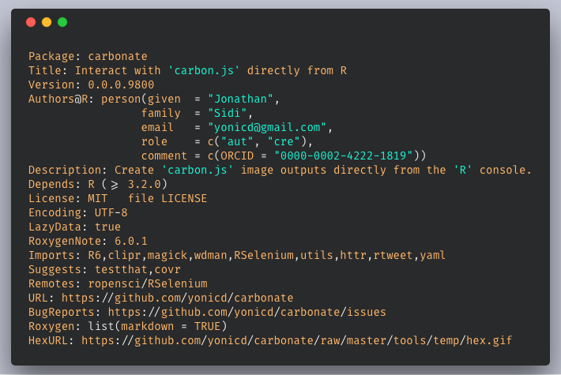
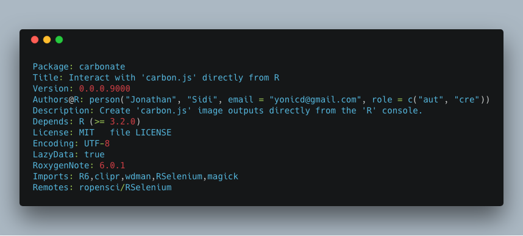
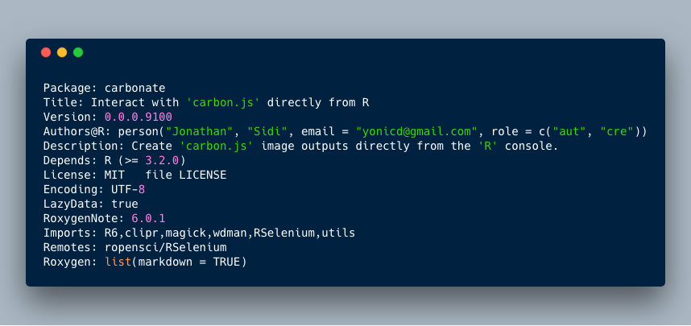
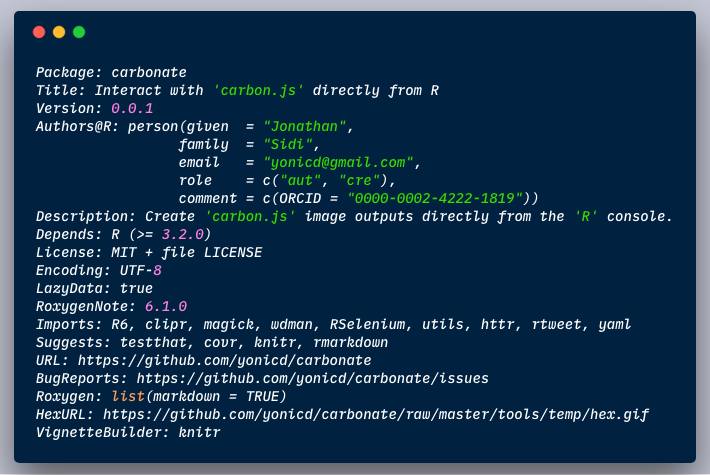
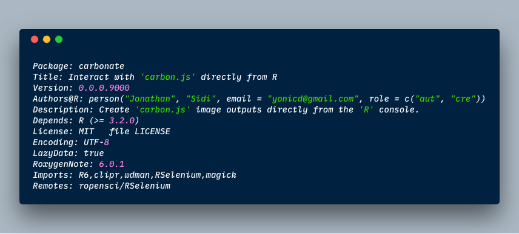
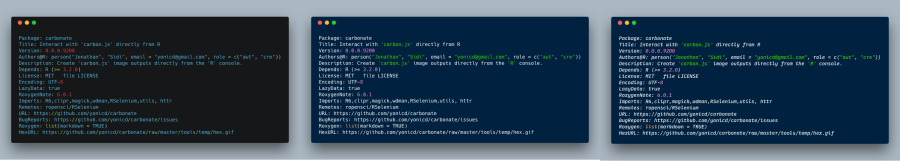
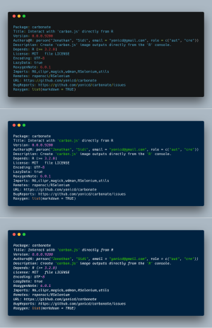
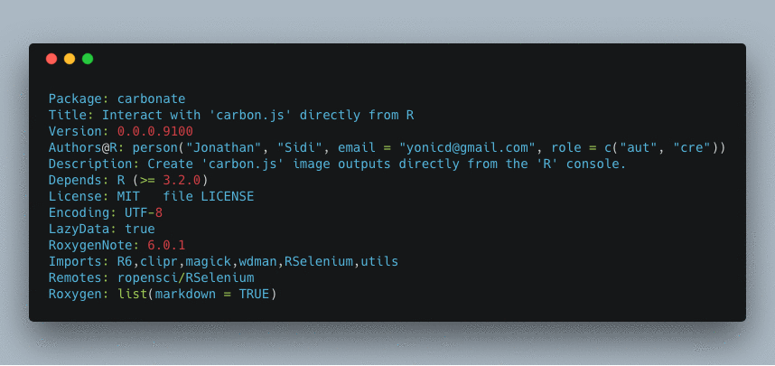

<!-- README.md is generated from README.Rmd. Please edit that file -->

# carbonate 

“[carbon.js](https://carbon.now.sh/about) is the easiest way to create
beautiful images of your source code.”

This package uses an `R6` api to interact with carbon.js and create
directly from the console carbon images.

Like the image below:


## Installation

``` r
remotes::install_github('yonicd/carbonate')
```

## Usage

### Initialize new carbon object

``` r
library(carbonate)
```

The default code in the carbon object is taken from the clipboard.

``` r
x <- carbon$new()
```

But can also be defined inline. Code can be a character object of any
length.

``` r
x <- carbon$new(readLines('DESCRIPTION'))
```

The code is kept in the object and can be changed at any time.

``` r
x$code
#>  [1] "Package: carbonate"                                                                                 
#>  [2] "Title: Interact with 'carbon.js' directly from R"                                                   
#>  [3] "Version: 0.0.0.9200"                                                                                
#>  [4] "Authors@R: person(\"Jonathan\", \"Sidi\", email = \"yonicd@gmail.com\", role = c(\"aut\", \"cre\"))"
#>  [5] "Description: Create 'carbon.js' image outputs directly from the 'R' console."                       
#>  [6] "Depends: R (>= 3.2.0)"                                                                              
#>  [7] "License: MIT + file LICENSE"                                                                        
#>  [8] "Encoding: UTF-8"                                                                                    
#>  [9] "LazyData: true"                                                                                     
#> [10] "RoxygenNote: 6.0.1"                                                                                 
#> [11] "Imports: R6,clipr,magick,wdman,RSelenium,utils, httr"                                               
#> [12] "Remotes: ropensci/RSelenium"                                                                        
#> [13] "URL: https://github.com/yonicd/carbonate"                                                           
#> [14] "BugReports: https://github.com/yonicd/carbonate/issues"                                             
#> [15] "Roxygen: list(markdown = TRUE)"                                                                     
#> [16] "HexURL: https://github.com/yonicd/carbonate/raw/master/tools/temp/hex.gif"
```

The main job of the R6 object is to convert all the options into a uri
that is sent to the carbon url page, where it is processed.

``` r
x$uri()
#> [1] "https://carbon.now.sh?bg=rgba(171,184,195,1)&t=seti&wt=none&l=r&ds=true&dsyoff=20px&dsblur=68px&wc=true&wa=true&pv=48px&ph=32px&ln=false&fm=Hack&fs=14px&lh=133%25&si=false&es=1x&wm=false&ts=false&code=Package%253A%2520carbonate%250ATitle%253A%2520Interact%2520with%2520'carbon.js'%2520directly%2520from%2520R%250AVersion%253A%25200.0.0.9200%250AAuthors@R%253A%2520person(%2522Jonathan%2522,%2520%2522Sidi%2522,%2520email%2520%253D%2520%2522yonicd@gmail.com%2522,%2520role%2520%253D%2520c(%2522aut%2522,%2520%2522cre%2522))%250ADescription%253A%2520Create%2520'carbon.js'%2520image%2520outputs%2520directly%2520from%2520the%2520'R'%2520console.%250ADepends%253A%2520R%2520(%253E%253D%25203.2.0)%250ALicense%253A%2520MIT%2520+%2520file%2520LICENSE%250AEncoding%253A%2520UTF-8%250ALazyData%253A%2520true%250ARoxygenNote%253A%25206.0.1%250AImports%253A%2520R6,clipr,magick,wdman,RSelenium,utils,%2520httr%250ARemotes%253A%2520ropensci/RSelenium%250AURL%253A%2520https%253A//github.com/yonicd/carbonate%250ABugReports%253A%2520https%253A//github.com/yonicd/carbonate/issues%250ARoxygen%253A%2520list(markdown%2520%253D%2520TRUE)%250AHexURL%253A%2520https%253A//github.com/yonicd/carbonate/raw/master/tools/temp/hex.gif"
```

### Manipulate carbon object

Aesthetics of the carbon object that can be
manipulated

| Carbon Variable | Carbonate Variable         | Description                                                              |         Default          |
| :-------------: | :------------------------- | :----------------------------------------------------------------------- | :----------------------: |
|        l        | language                   | language                                                                 |            r             |
|       bg        | palette                    | layout pallete (vector with c(r,g,b,a)                                   | c(r=171,g=184,b=195,a=1) |
|        t        | template                   | layout template (listed in get\_templates())                             |          ‘seti’          |
|       wc        | add\_window\_control       | add/remove window controls (circles on top left corner)                  |           TRUE           |
|       wt        | window\_control\_theme     | change window control themes (listed in get\_windows\_control\_themes()) |          ‘none’          |
|       ds        | add\_drop\_shadow          | add/remove dropshadow                                                    |           TRUE           |
|     dsyoff      | drop\_shadow\_offset\_y    | shadow vertical offset (px)                                              |            20            |
|     dsblur      | drop\_shadow\_blur\_radius | shadow blur radius (px)                                                  |            68            |
|       wa        | auto\_adjust\_width        | auto-audjust output width                                                |           TRUE           |
|       pv        | padding\_vertical          | vertical padding (px)                                                    |            48            |
|       ph        | padding\_horizontal        | horizontal padding (px)                                                  |            32            |
|       ln        | add\_line\_number          | add/remove line numbers                                                  |          FALSE           |
|       fm        | font\_family               | layout font family (listed in get\_font\_families())                     |          ‘Hack’          |
|       fs        | font\_size                 | font size (px)                                                           |            14            |
|       lh        | line\_height\_percent      | relative space between lines (percent)                                   |           133            |
|       si        | square\_image              | output image is square                                                   |          FALSE           |
|       es        | relative\_export\_size     | image size in export relative to what is in the preview (1,2 or 4)       |            1             |
|       wm        | add\_watermark             | add official carbon.js watermark                                         |          FALSE           |

``` r
x$get_templates()
#>  [1] "3024-night"            "blackboard"           
#>  [3] "base16-dark"           "base16-light"         
#>  [5] "cobalt"                "dracula"              
#>  [7] "duotone"               "hopscotch"            
#>  [9] "material"              "monokai"              
#> [11] "night-owl"             "oceanic-next"         
#> [13] "one-dark"              "panda"                
#> [15] "paraiso"               "seti"                 
#> [17] "solarized dark"        "solarized light"      
#> [19] "tomorrow-night-bright" "lucario"              
#> [21] "twilight"              "verminal"             
#> [23] "yeti"                  "zenburn"
```

``` r
x$get_font_families()
#>  [1] "Anonymous Pro"       "Droid Sans Mono"     "Fantasque Sans Mono"
#>  [4] "Fira Code"           "Monoid"              "Hack"               
#>  [7] "IBM Plex Mono"       "Iosevka"             "Inconsolata"        
#> [10] "Source Code Pro"     "Ubuntu Mono"
```

``` r
x$get_windows_control_themes()
#> [1] "none"  "sharp" "bw"
```

### Open carbon code in browser

``` r
x$browse()
```

### Set the download directory

``` r
x$chrome_pref$download.default_directory <- normalizePath("tools/temp")
```

### Carbonate code directly to file

This function depends on RSelenium

``` r
x$carbonate(file = 'myfile.png')
#> starting chrome session...
#> checking chromedriver versions:
#> BEGIN: PREDOWNLOAD
#> BEGIN: DOWNLOAD
#> BEGIN: POSTDOWNLOAD
```

<!-- -->

<!--  -->

``` r
x$template <-'cobalt'
x$carbonate(file = 'new_template.png')
```

<!-- -->

<!--  -->

``` r
x$font_family <-'IBM Plex Mono'
x$carbonate(file = 'new_font.png')
```

<!-- -->

<!--  -->

### Closing Browsers

Closing all instances of open browsers used by RSelenium.

``` r
x$stop_all()
```

### Post image processing

All carbon outputs are collected and saved in the list `x$carbons`

#### Combining

``` r
x$carbons%>%
  magick::image_scale('300')%>%
  magick::image_append()
```

<!-- -->

``` r

x$carbons%>%
  magick::image_scale('300')%>%
  magick::image_append(stack = TRUE)
```

<!-- -->

#### GIFs

``` r
x$carbons%>%
  magick::image_animate(fps = 1)
```

<!-- -->
