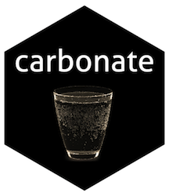

# carbonate 
`R6` api for [carbon.js](https://carbon.now.sh/about)


## Installation

```r
remotes::install_github('yonicd/carbonate')
```

## Usage

### Initialize new carbon object

```r
library(carbonate)
```

```r
x <- carbon$new() # default code is the clipboard

x$code <- readLines('DESCRIPTION') # code can be a character object of any length
```

### Manipulate carbon object

Aesthetics of the carbon object that can be manipulated

|Carbon Variable  |Carbonate Variable |Description | Default | 
|:------:|:-----------------------|:-----------|:----:|
|l      |language                |language          |r|
|bg     |palette                 |layout pallete (vector with c(r,g,b,a)|c(r=171,g=184,b=195,a=1)|
|t      |template                |layout template (listed in get_templates()) |'seti'|
|wc     |add_window_control      |add/remove window controls (circles on top left corner) |TRUE|
|wt     |window_control_theme    |change window control themes  (listed in get_windows_control_themes())        |'none'|
|ds     |add_drop_shadow         |add/remove dropshadow     |TRUE|
|dsyoff |drop_shadow_offset_y    |shadow vertical offset (px) |20|
|dsblur |drop_shadow_blur_radius |shadow blur radius (px) |68|
|wa     |auto_adjust_width       |auto-audjust output width          |TRUE|
|pv     |padding_vertical        |vertical padding (px)          |48|
|ph     |padding_horizontal      |horizontal padding (px)          |32|
|ln     |add_line_number         |add/remove line numbers          |FALSE|
|fm     |font_family             |layout font family (listed in get_font_families())          |'Hack'|
|fs     |font_size               |font size (px)         |14|
|lh     |line_height_percent     |relative space between lines (percent)          |133|
|si     |square_image            |output image is square     |FALSE|
|es     |relative_export_size    |image size in export relative to what is in the preview (1,2 or 4)    |1|
|wm     |add_watermark           |add official carbon.js watermark          |FALSE|

```r
x$get_windows_control_themes()
[1] "none"  "sharp" "bw"

x$get_font_families()
 [1] "Anonymous Pro"       "Droid Sans Mono"     "Fantasque Sans Mono" "Fira Code"          
 [5] "Monoid"              "Hack"                "IBM Plex Mono"       "Iosevka"            
 [9] "Inconsolata"         "Source Code Pro"     "Ubuntu Mono"
 
x$get_templates()

 [1] "3024-night"            "blackboard"            "base16-dark"           "base16-light"          "cobalt"                "dracula"              
 [7] "duotone"               "hopscotch"             "material"              "monokai"               "night-owl"             "oceanic-next"         
[13] "one-dark"              "panda"                 "paraiso"               "seti"                  "solarized dark"        "solarized light"      
[19] "tomorrow-night-bright" "lucario"               "twilight"              "verminal"              "yeti"                  "zenburn"   
```


### Open carbon code in browser

```r
x$browse()
```

### Carbonate code directly to file

This function depends on RSelenium

```r
x$carbonate(file = 'myfile.png') # can be either png or svg
```


### Closing the browser

```r
x$stop()
```

#### Changing the template

```r
x$template <- "lucario"
x$carbonate(file = 'example.png')
```


### Creating gifs

All carbon outputs are collected and saved in the list `x$carbons`

printing the list will create a gif

```r
x$carbons
```


