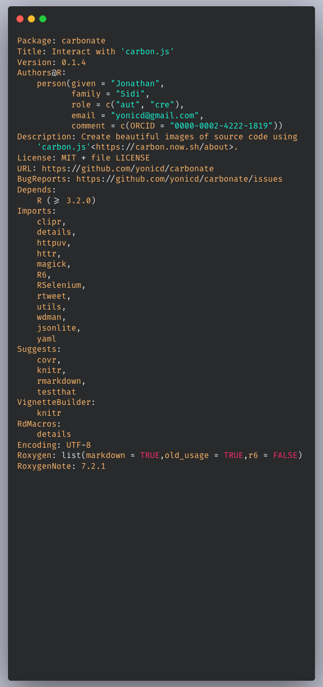
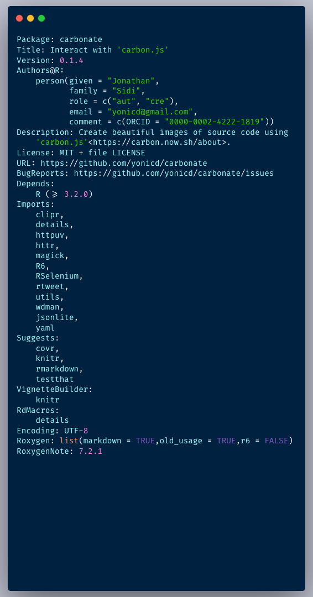
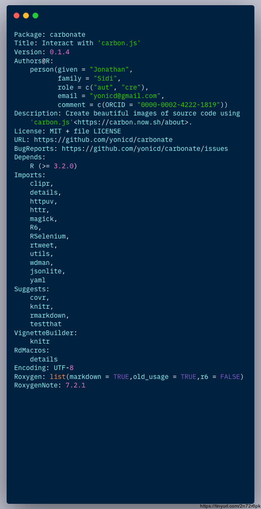
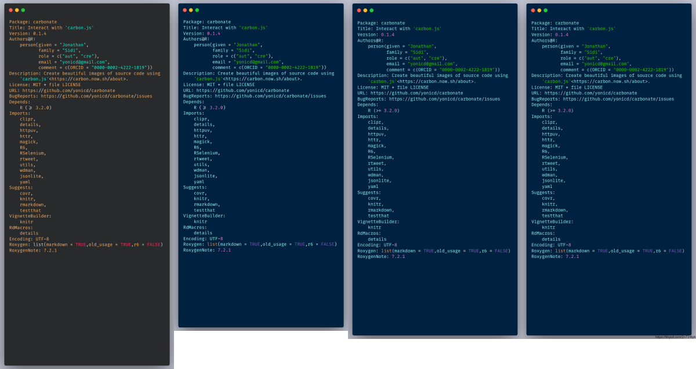
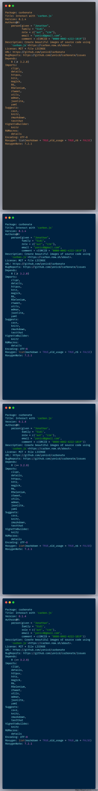
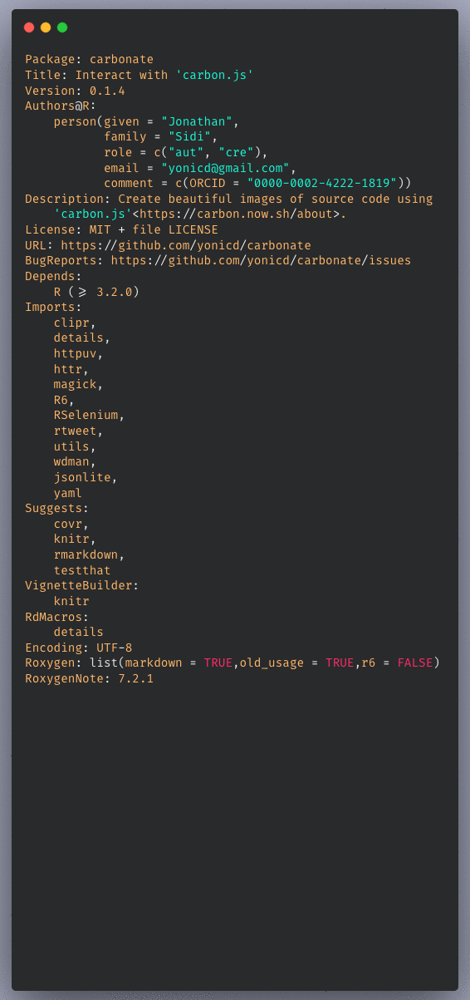

<!-- README.md is generated from README.Rmd. Please edit that file -->

[](https://cran.r-project.org/package=carbonate)
[](https://cran.r-project.org/package=carbonate)
[](https://travis-ci.org/yonicd/carbonate)
[](https://codecov.io/github/yonicd/carbonate?branch=master)
[](https://goo.gl/gNRcCb)

# carbonate 

“[carbon.js](https://carbon.now.sh/about) is the easiest way to create
beautiful images of your source code.”

This package uses an `R6` api to interact with carbon.js and create
directly from the console carbon images.

Like the image below:

<!-- -->

## Installation

``` r
#remotes::install_github('yonicd/carbonate')
install.packages('carbonate')
```

## Usage

### Initialize new carbon object

``` r
library(carbonate)
```

The default code in the carbon object is taken from the clipboard.

``` r
x <- carbon$new()
```

But can also be defined inline. Code can be a character object of any
length.

``` r
x <- carbon$new(readLines('DESCRIPTION'))
```

The code is kept in the object and can be changed at any time.

``` r
x$code
#>  [1] "Package: carbonate"                                       
#>  [2] "Title: Interact with 'carbon.js'"                         
#>  [3] "Version: 0.1.3"                                           
#>  [4] "Authors@R: "                                              
#>  [5] "    person(given = \"Jonathan\","                         
#>  [6] "           family = \"Sidi\","                            
#>  [7] "           role = c(\"aut\", \"cre\"),"                   
#>  [8] "           email = \"yonicd@gmail.com\","                 
#>  [9] "           comment = c(ORCID = \"0000-0002-4222-1819\"))" 
#> [10] "Description: Create beautiful images of source code using"
#> [11] "    'carbon.js'<https://carbon.now.sh/about>."            
#> [12] "License: MIT + file LICENSE"                              
#> [13] "URL: https://github.com/yonicd/carbonate"                 
#> [14] "BugReports: https://github.com/yonicd/carbonate/issues"   
#> [15] "Depends: "                                                
#> [16] "    R (>= 3.2.0)"                                         
#> [17] "Imports: "                                                
#> [18] "    clipr,"                                               
#> [19] "    details,"                                             
#> [20] "    httr,"                                                
#> [21] "    magick,"                                              
#> [22] "    R6,"                                                  
#> [23] "    RSelenium,"                                           
#> [24] "    rtweet,"                                              
#> [25] "    utils,"                                               
#> [26] "    wdman,"                                               
#> [27] "    yaml"                                                 
#> [28] "Suggests: "                                               
#> [29] "    covr,"                                                
#> [30] "    knitr,"                                               
#> [31] "    rmarkdown,"                                           
#> [32] "    testthat"                                             
#> [33] "VignetteBuilder: "                                        
#> [34] "    knitr"                                                
#> [35] "RdMacros: "                                               
#> [36] "    details"                                              
#> [37] "Encoding: UTF-8"                                          
#> [38] "LazyData: true"                                           
#> [39] "Roxygen: list(markdown = TRUE)"                           
#> [40] "RoxygenNote: 6.1.1"
```

The main job of the R6 object is to convert all the options into a uri
that is sent to the carbon url page, where it is processed.

``` r
x$uri()
#> [1] "https://carbon.now.sh/?bg=rgba(171%2C175%2C195%2C0.7)&t=panda-syntax&wt=none&l=r&ds=true&dsyoff=20px&dsblur=68px&wc=true&wa=true&pv=11px&ph=14px&ln=false&fm=Fira%20Code&fs=14px&lh=133%25&si=false&es=1x&wm=false&ts=false&code=Package%253A%2520carbonate%250ATitle%253A%2520Interact%2520with%2520%27carbon.js%27%250AVersion%253A%25200.1.3%250AAuthors%2540R%253A%2520%250A%2520%2520%2520%2520person(given%2520%253D%2520%2522Jonathan%2522%252C%250A%2520%2520%2520%2520%2520%2520%2520%2520%2520%2520%2520family%2520%253D%2520%2522Sidi%2522%252C%250A%2520%2520%2520%2520%2520%2520%2520%2520%2520%2520%2520role%2520%253D%2520c(%2522aut%2522%252C%2520%2522cre%2522)%252C%250A%2520%2520%2520%2520%2520%2520%2520%2520%2520%2520%2520email%2520%253D%2520%2522yonicd%2540gmail.com%2522%252C%250A%2520%2520%2520%2520%2520%2520%2520%2520%2520%2520%2520comment%2520%253D%2520c(ORCID%2520%253D%2520%25220000-0002-4222-1819%2522))%250ADescription%253A%2520Create%2520beautiful%2520images%2520of%2520source%2520code%2520using%250A%2520%2520%2520%2520%27carbon.js%27%253Chttps%253A%252F%252Fcarbon.now.sh%252Fabout%253E.%250ALicense%253A%2520MIT%2520%252B%2520file%2520LICENSE%250AURL%253A%2520https%253A%252F%252Fgithub.com%252Fyonicd%252Fcarbonate%250ABugReports%253A%2520https%253A%252F%252Fgithub.com%252Fyonicd%252Fcarbonate%252Fissues%250ADepends%253A%2520%250A%2520%2520%2520%2520R%2520(%253E%253D%25203.2.0)%250AImports%253A%2520%250A%2520%2520%2520%2520clipr%252C%250A%2520%2520%2520%2520details%252C%250A%2520%2520%2520%2520httr%252C%250A%2520%2520%2520%2520magick%252C%250A%2520%2520%2520%2520R6%252C%250A%2520%2520%2520%2520RSelenium%252C%250A%2520%2520%2520%2520rtweet%252C%250A%2520%2520%2520%2520utils%252C%250A%2520%2520%2520%2520wdman%252C%250A%2520%2520%2520%2520yaml%250ASuggests%253A%2520%250A%2520%2520%2520%2520covr%252C%250A%2520%2520%2520%2520knitr%252C%250A%2520%2520%2520%2520rmarkdown%252C%250A%2520%2520%2520%2520testthat%250AVignetteBuilder%253A%2520%250A%2520%2520%2520%2520knitr%250ARdMacros%253A%2520%250A%2520%2520%2520%2520details%250AEncoding%253A%2520UTF-8%250ALazyData%253A%2520true%250ARoxygen%253A%2520list(markdown%2520%253D%2520TRUE)%250ARoxygenNote%253A%25206.1.1"
```

Click the
[link](https://carbon.now.sh/?bg=rgba\(171%2C175%2C195%2C0.7\)&t=panda-syntax&wt=none&l=r&ds=true&dsyoff=20px&dsblur=68px&wc=true&wa=true&pv=11px&ph=14px&ln=false&fm=Fira%20Code&fs=14px&lh=133%25&si=false&es=1x&wm=false&ts=false&code=Package%253A%2520carbonate%250ATitle%253A%2520Interact%2520with%2520%27carbon.js%27%250AVersion%253A%25200.1.3%250AAuthors%2540R%253A%2520%250A%2520%2520%2520%2520person\(given%2520%253D%2520%2522Jonathan%2522%252C%250A%2520%2520%2520%2520%2520%2520%2520%2520%2520%2520%2520family%2520%253D%2520%2522Sidi%2522%252C%250A%2520%2520%2520%2520%2520%2520%2520%2520%2520%2520%2520role%2520%253D%2520c\(%2522aut%2522%252C%2520%2522cre%2522\)%252C%250A%2520%2520%2520%2520%2520%2520%2520%2520%2520%2520%2520email%2520%253D%2520%2522yonicd%2540gmail.com%2522%252C%250A%2520%2520%2520%2520%2520%2520%2520%2520%2520%2520%2520comment%2520%253D%2520c\(ORCID%2520%253D%2520%25220000-0002-4222-1819%2522\)\)%250ADescription%253A%2520Create%2520beautiful%2520images%2520of%2520source%2520code%2520using%250A%2520%2520%2520%2520%27carbon.js%27%253Chttps%253A%252F%252Fcarbon.now.sh%252Fabout%253E.%250ALicense%253A%2520MIT%2520%252B%2520file%2520LICENSE%250AURL%253A%2520https%253A%252F%252Fgithub.com%252Fyonicd%252Fcarbonate%250ABugReports%253A%2520https%253A%252F%252Fgithub.com%252Fyonicd%252Fcarbonate%252Fissues%250ADepends%253A%2520%250A%2520%2520%2520%2520R%2520\(%253E%253D%25203.2.0\)%250AImports%253A%2520%250A%2520%2520%2520%2520clipr%252C%250A%2520%2520%2520%2520details%252C%250A%2520%2520%2520%2520httr%252C%250A%2520%2520%2520%2520magick%252C%250A%2520%2520%2520%2520R6%252C%250A%2520%2520%2520%2520RSelenium%252C%250A%2520%2520%2520%2520rtweet%252C%250A%2520%2520%2520%2520utils%252C%250A%2520%2520%2520%2520wdman%252C%250A%2520%2520%2520%2520yaml%250ASuggests%253A%2520%250A%2520%2520%2520%2520covr%252C%250A%2520%2520%2520%2520knitr%252C%250A%2520%2520%2520%2520rmarkdown%252C%250A%2520%2520%2520%2520testthat%250AVignetteBuilder%253A%2520%250A%2520%2520%2520%2520knitr%250ARdMacros%253A%2520%250A%2520%2520%2520%2520details%250AEncoding%253A%2520UTF-8%250ALazyData%253A%2520true%250ARoxygen%253A%2520list\(markdown%2520%253D%2520TRUE\)%250ARoxygenNote%253A%25206.1.1)
to see the URI works.

### Manipulate carbon object

Aesthetics of the carbon object that can be
manipulated

| Carbon Variable | Carbonate Variable         | Description                                                              |         Default          |
| :-------------: | :------------------------- | :----------------------------------------------------------------------- | :----------------------: |
|        l        | language                   | language                                                                 |            r             |
|       bg        | palette                    | layout pallete (vector with c(r,g,b,a)                                   | c(r=171,g=184,b=195,a=1) |
|        t        | template                   | layout template (listed in get\_templates())                             |          ‘seti’          |
|       wc        | add\_window\_control       | add/remove window controls (circles on top left corner)                  |           TRUE           |
|       wt        | window\_control\_theme     | change window control themes (listed in get\_windows\_control\_themes()) |          ‘none’          |
|       ds        | add\_drop\_shadow          | add/remove dropshadow                                                    |           TRUE           |
|     dsyoff      | drop\_shadow\_offset\_y    | shadow vertical offset (px)                                              |            20            |
|     dsblur      | drop\_shadow\_blur\_radius | shadow blur radius (px)                                                  |            68            |
|       wa        | auto\_adjust\_width        | auto-audjust output width                                                |           TRUE           |
|       pv        | padding\_vertical          | vertical padding (px)                                                    |            48            |
|       ph        | padding\_horizontal        | horizontal padding (px)                                                  |            32            |
|       ln        | add\_line\_number          | add/remove line numbers                                                  |          FALSE           |
|       fm        | font\_family               | layout font family (listed in get\_font\_families())                     |          ‘Hack’          |
|       fs        | font\_size                 | font size (px)                                                           |            14            |
|       lh        | line\_height\_percent      | relative space between lines (percent)                                   |           133            |
|       si        | square\_image              | output image is square                                                   |          FALSE           |
|       es        | relative\_export\_size     | image size in export relative to what is in the preview (1,2 or 4)       |            1             |
|       wm        | add\_watermark             | add official carbon.js watermark                                         |          FALSE           |

``` r
x$get_templates()
#>  [1] "3024-night"            "blackboard"           
#>  [3] "base16-dark"           "base16-light"         
#>  [5] "cobalt"                "dracula"              
#>  [7] "duotone"               "hopscotch"            
#>  [9] "material"              "monokai"              
#> [11] "night-owl"             "oceanic-next"         
#> [13] "one-dark"              "panda-syntax"         
#> [15] "paraiso"               "seti"                 
#> [17] "solarized dark"        "solarized light"      
#> [19] "tomorrow-night-bright" "lucario"              
#> [21] "twilight"              "verminal"             
#> [23] "yeti"                  "zenburn"
```

``` r
x$get_font_families()
#>  [1] "Anonymous Pro"       "Droid Sans Mono"     "Fantasque Sans Mono"
#>  [4] "Fira Code"           "Monoid"              "Hack"               
#>  [7] "IBM Plex Mono"       "Iosevka"             "Inconsolata"        
#> [10] "Source Code Pro"     "Ubuntu Mono"
```

``` r
x$get_windows_control_themes()
#> [1] "none"  "sharp" "bw"
```

### Personal Configuration

Users can use a file called `carbon.yml` and place it in their home
directory (`~`) to override the packages defaults in order to create a
session peristent carbon template they like. The config file controls
all the [public carbon object fields](#manipulate-carbon-object). The
following is an example of such a configuration file.

These fields will set

  - The palette (rgba) `g` and `a` fields to 175 and 0.7 respectively
  - The template will be set to `panda-syntax`
  - The font to `Fira Code`
  - The padding around the output will be made tighter than the system
    defaults 11px and 14px.

<!-- end list -->

``` yml
palette:
- g: 175.0
- a: 0.7
template: panda-syntax
font_family: Fira Code
padding_vertical: 11
padding_horizontal: 14
```

### Open carbon code in browser

``` r
x$browse()
```

### Set the download directory

``` r
x$download_path <- file.path('README_files/download')
```

### Carbonate code directly to file

This function depends on RSelenium

``` r
x$carbonate(file = 'myfile.png')
```

<!-- -->

``` r
x$template <-'cobalt'
x$carbonate(file = 'new_template.png')
```

<!-- -->

``` r
x$font_family <-'IBM Plex Mono'
x$carbonate(file = 'new_font.png')
```

<!-- -->

### Carbonate code directly to file in specific directory

### Closing Browsers

Closing all instances of open browsers used by RSelenium.

``` r
x$stop_all()
```

### Sharing

<details>

<summary>Tinyurl</summary>

You can also put a tinyurl link as a watermark on the image produced
that will open to the carbon.now.sh page that has the code in the image.

``` r
x$add_tinyurl <- TRUE
x$carbonate(file = 'tiny_url.png')
```

<!-- -->

If you just want the tinyurl link without the image to use in a tweet
you can create it using

``` r
x$tiny()
#> [1] "http://tinyurl.com/rovuzwc"
```

Or you can put the link directly on your clipboard

``` r
x$tiny(clip = TRUE)
clipr::read_clip()
```

</details>

<details>

<summary>Twitter</summary>

##### Direct

You can also directly tweet the image. An automatic status is created
with two options

  - Default
      - Created in R using the Carbonate 📦
  - When `add_tinyurl <- TRUE`
      - Created in R using the Carbonate 📦 Check out this script at 🔗
        <http://tinyurl.com/rovuzwc>
  - Manual
      - Using `tweet_status` you can write your own status.

<!-- end list -->

``` r
x <- carbonate::carbon$new()
x$tweet <- TRUE
x$carbonate()
```

##### Post process (Batch)

If you have images stored in `x$carbons` you can post them also in a
tweet using.

``` r
# for multiple png attachments
x$rtweet(x$carbons,media_type = 'png') #using default status

# subsets of images
x$rtweet(status='These are images',x$carbons[c(1,3)],media_type = 'png')

# for gifs
x$rtweet(status='This is a gif', x$carbons,media_type = 'gif')
```

</details>

### Post image processing

All carbon outputs are collected and saved in the list `x$carbons`

<details>

<summary>Combining</summary>

``` r
x$carbons%>%
  magick::image_scale('300')%>%
  magick::image_append()
```

<!-- -->

``` r

x$carbons%>%
  magick::image_scale('300')%>%
  magick::image_append(stack = TRUE)
```

<!-- -->

</details>

<details>

<summary>GIFs</summary>

``` r
x$carbons%>%
  magick::image_animate(fps = 1)
```

<!-- -->

</details>
